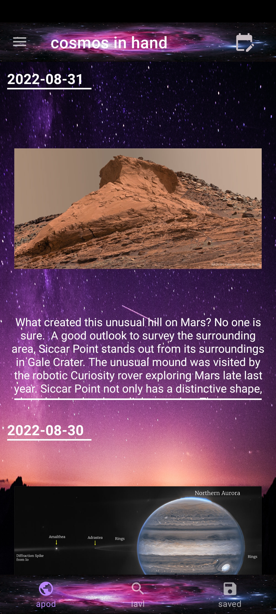
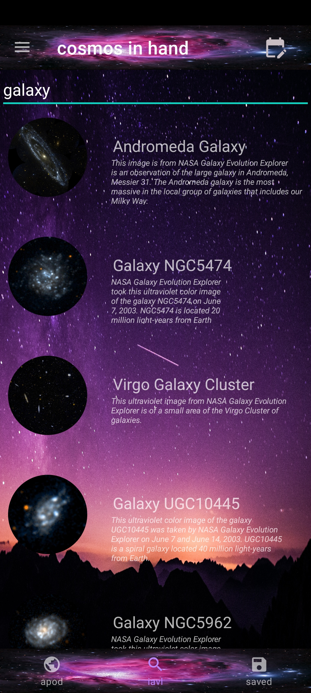
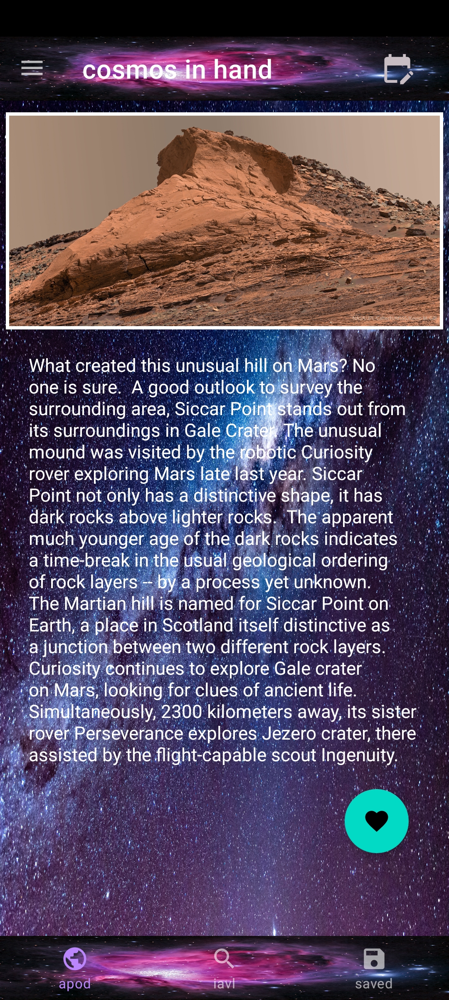
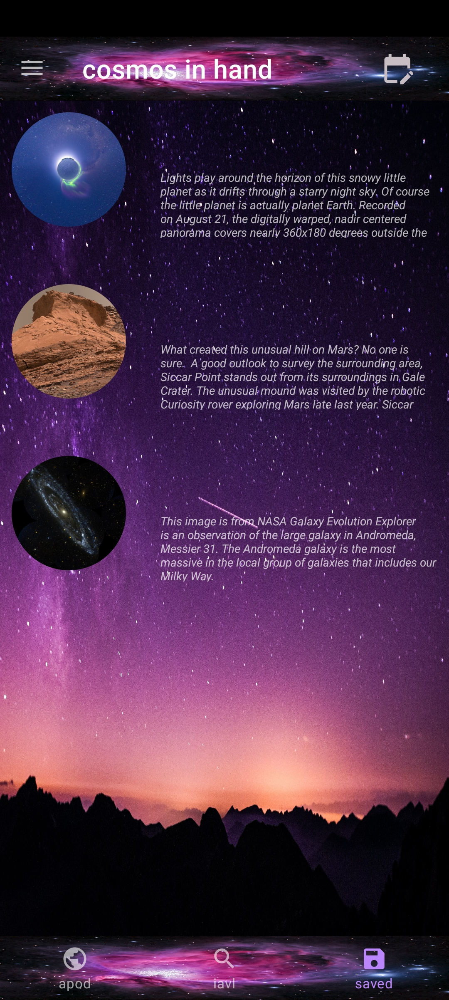

# Cosmos In Hand

This is an app build on NASA Open API🛸. this APP can be used to see
the APOD  i.e  Astronomy Picture of the Day.  you can search for 
any Astronomical object🌏 in this app and the result will come from
NASA image and Video Library.
If you like ❤ some information and want to save it to your device you
can do it in this app and visit it again .
In some Cases if you dont want to read the details we have 
text to speech implementation by which you can just listen it 
easily.

## Roadmap

- Kotlin

- LiveData

- Navigation

- ViewModel

- Room

- Coroutines 

- Retrofit

## Screenshots

