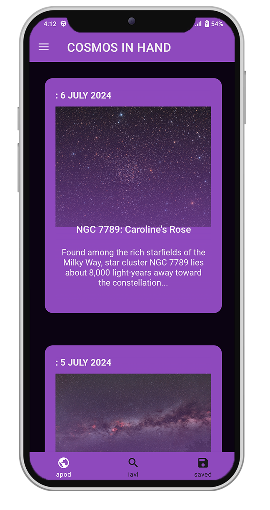
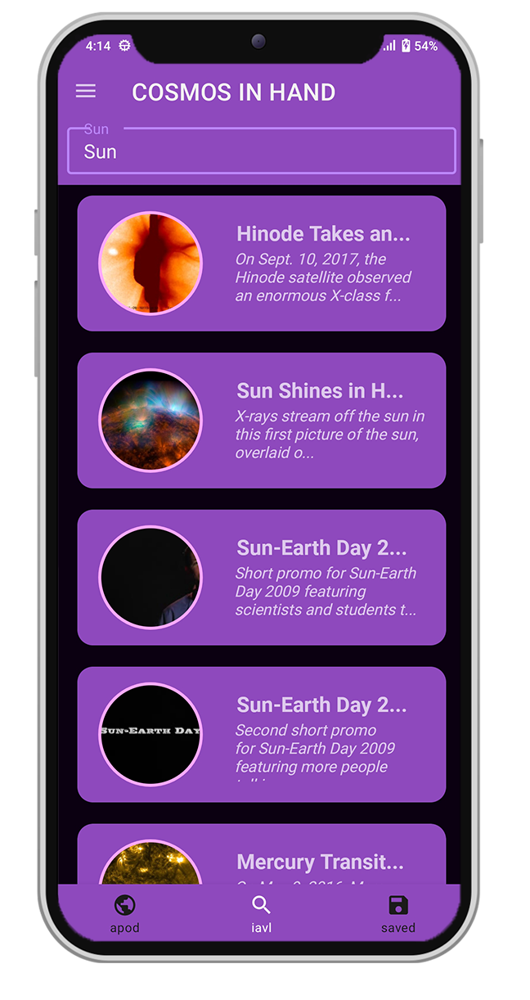
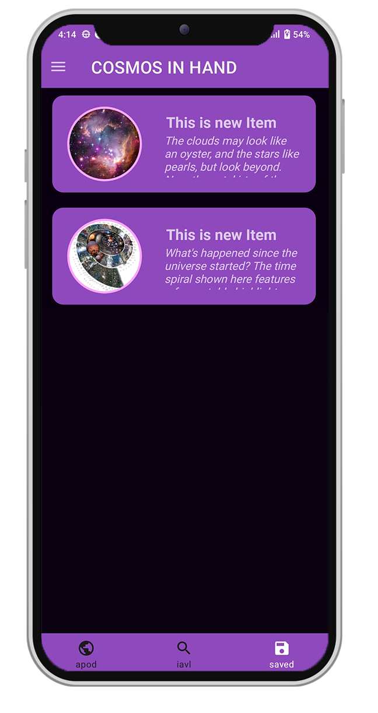
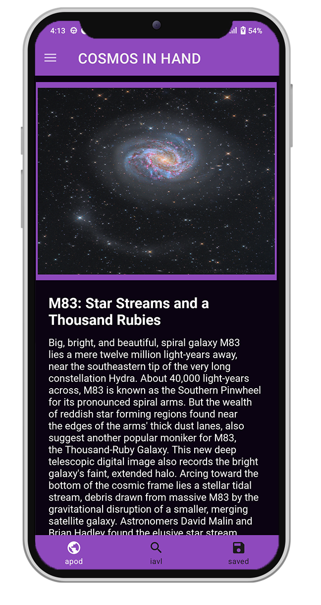
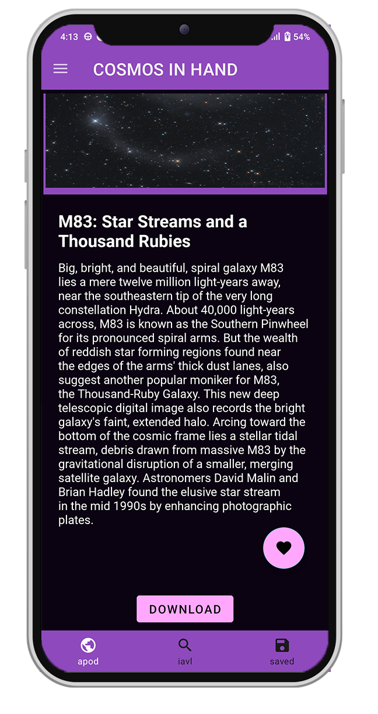

# Cosmos in Hand 🌍🌠✨🔭

<!--  -->

## An app designed to explore NASA's groundbreaking research 🚀✨🪐🔍.

## About the App 🔍📖ℹ️

🚀 This app is built on NASA's Open API 🛸. Use it to explore the Astronomy Picture of the Day (APOD) and search for any astronomical object 🌏. Results come directly from NASA's Image and Video Library (IAVL). If you find information you love ❤, you can save it to your device and revisit anytime. Downloaded images are of very high quality 📸, and for those moments when you prefer listening, our text-to-speech feature makes it easy to hear all the details 🔊.

## Key Features 🚀💡🛠️

- Get Astronomy Picture of the Day 📅🖼️
- Search from NASA's Image and Video Library 🔍🪐
- Download stunning pictures in high quality 📸📥
- Text reader for listening to page details 🔊📖
- Save pages you like for easy access later ❤️💾

## Different Screens 📱📲📳

Here are the various screens related to the app: 📱

<b>Apod Screen </B>: Astronomy pictures of the day

<b>IAVL Screen : </B> Image and Video Library of Nasa

<b>Details Screen </B>: Details of the Apod or Iavl

<b>Saved Screen </B>: Saved or Liked Apod or iavl

<table style="width:100%">
  <tr>
    <th>
 APOD   
 </th>
    <th>
 IAVL  
</th>
    <th>
 SAVED  
</th>
  </tr>
  <tr>
    <td>
 
</td>
    <td>

</td>
    <td>

 </td>
  </tr>
    <tr>
    <th>
 DETAIL    
 </th>
    <th>
 SAVED AND DOWNLOAD 
</th>
  </tr>
  <tr>
    <td>
 
</td>
    <td>

</td>
  </tr>
</table>

## Roadmap🛣️🚓

- Kotlin
- LiveData
- Navigation
- ViewModel
- Room Database
- Coroutines
- Retrofit
- Text To Speech
- Glide
- Fragments
